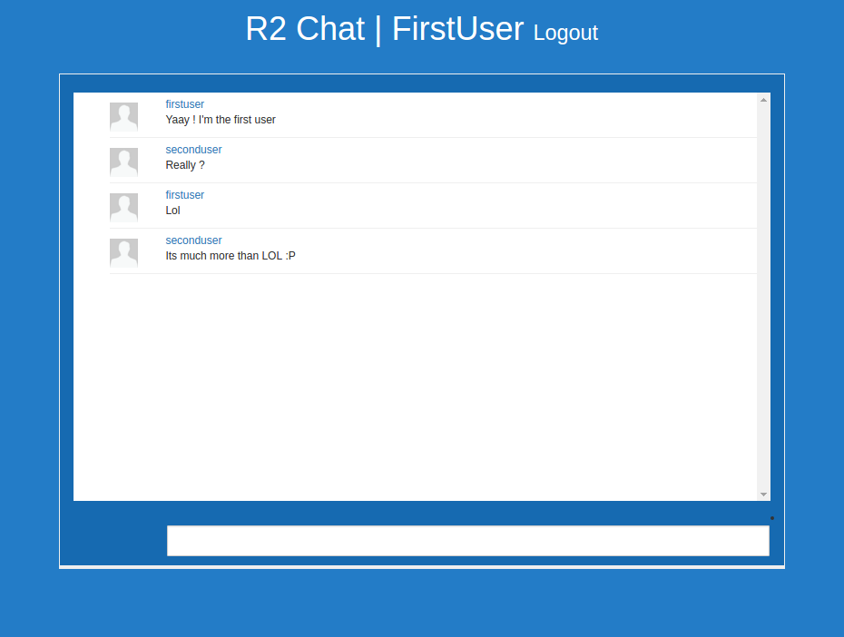

#R2 Chat

Realtime chat application built using Django





Assuming you have installed theses 

```
sudo apt-get install python-psycopg2  
sudo apt-get install redis-server
```


```
virtualenv venv 
source venv/bin/activate
pip install django django-debug-toolbar django-redis redis psycopg2


#start the django server
python manage.py migration
python manage.py makemigrations 
python manage.py runserver

cd nodejs
npm install 
node chat.js #this opens socket.io server on localhost:4000

```

 